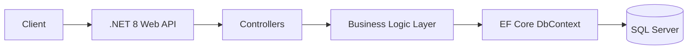
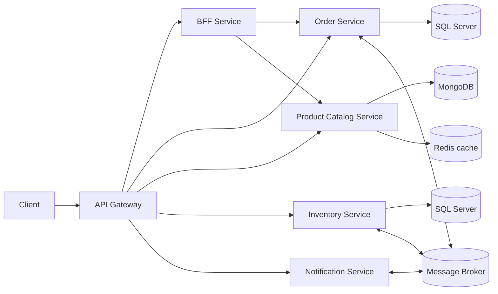

# E-Commerce: Monolith to Production-Style Microservices

A backend architecture project that evolves a **.NET 8 e-commerce monolith** into a
distributed microservices system — built step by step, following a structured,
phase-based methodology (service decomposition, database-per-service, polyglot
persistence, API Gateway, BFF, load balancing, asynchronous messaging with Saga,
distributed caching, and observability).

> 📌 **Status:** Phases 1–4 are complete and working end to end. Phase 5 is partially
> complete — structured logging and health checks are in place; correlation-ID tracing
> across the full saga is still in progress. See the status table below.

## Tech Stack

.NET 8 Web API · C# · Entity Framework Core · SQL Server · MongoDB · Redis · RabbitMQ (or equivalent broker) · API Gateway · Docker Compose · Swagger / OpenAPI · Structured logging (aggregated)

## Implementation Status

| Phase | Description | Status |
|---|---|---|
| Phase 1 | .NET 8 monolith (Products, Inventory, Orders) + Docker Compose + SQL Server | ✅ Completed |
| Phase 2 | Split into services + database-per-service + polyglot persistence | ✅ Completed |
| Phase 3 | API Gateway, BFF, and load balancing | ✅ Completed |
| Phase 4 | Async messaging, Order Saga, Redis cache-aside | ✅ Completed |
| Phase 5.1 | Structured logging, aggregated to one place | ✅ Completed |
| Phase 5.2 | Per-service `/health` endpoints wired into Docker Compose | ✅ Completed |
| Phase 5.3 | Correlation ID tracing a single order across all services and the broker | 🔧 In Progress |

## Phase 1 — Monolith Baseline (Completed)

A single .NET 8 Web API containing Product, Inventory, and Order logic, backed by
one SQL Server database, fully containerized with Docker Compose.

**Features implemented:**
- Product management and inventory tracking
- Order creation with inventory validation
- Automatic order confirmation when stock is available, rejection when it isn't
- Inventory decreases only on confirmed orders; rejected orders leave inventory untouched
- EF Core migrations applied automatically on startup
- Swagger / OpenAPI documentation

**Run it:**
```bash
docker compose up --build
# Swagger: http://localhost:8080/swagger
```

### Monolith Architecture



### Main Endpoints

**Products:** `GET /api/Products` · `GET /api/Products/{id}` · `POST /api/Products`
**Orders:** `GET /api/Orders` · `GET /api/Orders/{id}` · `POST /api/Orders`

### Why This Won't Scale (the problem this project solves)

1. **Tight coupling** — orders, products, and inventory all ship as one deployable; a small change means rebuilding the whole app.
2. **No independent scaling** — a spike in product-browsing traffic forces scaling the entire monolith, order and inventory logic included.
3. **Single database bottleneck** — every module shares one database, which becomes a single point of failure as the system grows.

## System Architecture

The system is composed of the following services, communicating through an API
Gateway and an asynchronous message broker:



### Order Saga (choreography-based, implemented)

1. Client places an order through the API Gateway.
2. `OrderService` saves the order as `Pending` and publishes `OrderPlaced`.
3. `InventoryService` consumes the event and checks stock.
4. `InventoryService` publishes `InventoryReserved` or `InventoryRejected`.
5. `OrderService` updates the order to `Confirmed` or `Rejected` (compensation).
6. `NotificationService` consumes the final-state event and notifies the customer.

Correlation-ID propagation through the broker so a single order's full journey can
be traced end to end is the one piece still being finished (Phase 5.3).

## Architecture Decisions

- **SQL Server for Orders and Inventory** — these domains need transactional
  consistency and ACID guarantees (money and stock counts can't be "eventually" correct).
- **MongoDB for the Product Catalog** — product attributes vary by
  category, which fits a flexible document model better than a fixed relational schema.
- **Redis** as a key-value cache for frequently read product data,
  using the cache-aside pattern.
- **Message broker + choreography-based Saga** to decouple services
  and handle partial failure without a central orchestrator.
- **API Gateway** so clients talk to one entry point instead of every
  service directly.

## Deliverables (per project brief)

- Git repository with `docker-compose.yml` and one-command startup
- Architecture document with diagrams and ADRs
- Demo evidence of the happy path and the compensation (failure) path
- Short architecture walkthrough presentation

## Roadmap

- [x] Phase 1 — Monolith + Docker Compose
- [x] Phase 2 — Microservices split + polyglot persistence + ADRs
- [x] Phase 3 — Gateway, BFF, load balancer
- [x] Phase 4 — Messaging, Saga, Redis cache
- [x] Phase 5.1 — Structured, aggregated logging
- [x] Phase 5.2 — Per-service health checks
- [ ] Phase 5.3 — Correlation ID tracing across the full saga
