# Ecommerce Monolith to Microservices

Backend architecture project built with **.NET 8 Web API**, **SQL Server**, **Entity Framework Core**, **MongoDB**, **YARP**, **RabbitMQ**, **Redis**, **Swagger**, **Docker**, and **Docker Compose**.

The project starts as a simple monolithic e-commerce API and evolves step by step into a production-style microservices architecture.

## System Architecture (Current State)

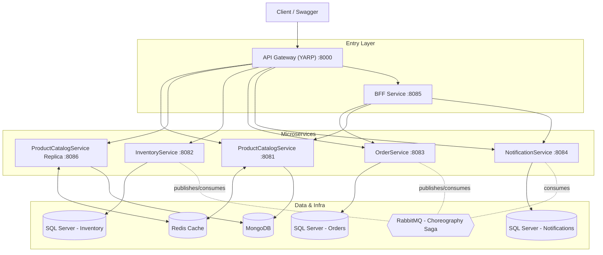

Two ProductCatalogService replicas share the same MongoDB database and the same Redis cache; the Gateway load-balances between them with RoundRobin. Order processing between OrderService, InventoryService, and NotificationService happens asynchronously through RabbitMQ (see the saga diagram in Phase 4).

## Project Goal

The goal of this project is to take a working monolithic API and gradually evolve it into a distributed system that demonstrates:

- Containers
- Microservices
- Database-per-service
- Polyglot persistence
- API Gateway
- BFF
- Load balancing
- Async messaging
- Choreography Saga pattern
- Distributed caching (Redis, cache-aside)
- Idempotent message consumers
- Health checks
- Monitoring and observability (in progress)

## Current Phase

**Phase 5 — Health Checks & Observability (partial)**

- Phase 1 — Monolith baseline ✅
- Phase 2 — Microservices split, database-per-service ✅
- Phase 3 — API Gateway, BFF, load balancing ✅
- Phase 4 — Async messaging, Choreography Saga, idempotency, Redis cache ✅
- Phase 5 — Health endpoints + Docker Compose healthchecks ✅
- Phase 5 — Structured logging (Serilog + Seq) and full Correlation ID trace — **planned, not yet implemented**

## Branches

- `master` — stable Phase 1 monolith
- `phase-2-microservices` — Phase 1 + Phase 2 + Phase 3
- `phase-4-async-saga` — adds Phase 4 (messaging, saga, Redis, idempotency)
- `phase-5-observability` — adds Phase 5 (health checks, docker healthchecks)

---

## Phase 1 — Monolith Baseline

A single .NET 8 Web API backed by one SQL Server database.

**Features**
- Product management
- Inventory tracking
- Order creation and validation
- Confirmed orders when stock is available, Rejected when not
- Inventory decreases only on confirmed orders
- EF Core migrations
- Swagger documentation
- Dockerfile + Docker Compose (API + SQL Server)

**Architecture**

```
Client / Swagger
      |
      v
.NET 8 Web API Monolith
      |
      +--> ProductsController
      +--> OrdersController
      |
      v
Business Logic Layer (ProductService, OrderService)
      |
      v
EF Core DbContext --> SQL Server
```

**Endpoints**

```
GET  /api/Products
GET  /api/Products/{id}
POST /api/Products

GET  /api/Orders
GET  /api/Orders/{id}
POST /api/Orders
```

Run at: `http://localhost:8080` · Swagger: `http://localhost:8080/swagger`

---

## Phase 2 — Microservices Split

The monolith was split into independent services, each owning its own database (polyglot persistence):

| Service | Database | Port |
|---|---|---|
| ProductCatalogService | MongoDB | 8081 (+ replica 8086) |
| InventoryService | SQL Server | 8082 |
| OrderService | SQL Server | 8083 |
| NotificationService | SQL Server | 8084 |

**Architecture Decisions**

- **ProductCatalogService → MongoDB**: product attributes vary by category, so a flexible document model fits better than rigid relational tables.
- **InventoryService → SQL Server**: stock reservation requires strong consistency and ACID guarantees to avoid over-reserving.
- **OrderService → SQL Server**: orders contain financial data and a naturally relational Order → OrderItem structure.
- **NotificationService → SQL Server**: simple structured notification records.

In Phase 2 the services still communicated **synchronously over HTTP**; this was replaced by async messaging in Phase 4.

---

## Phase 3 — API Gateway, BFF & Load Balancing

**API Gateway (YARP)** — single entry point on port `8000`, routing to internal services:

```
/api/products/**       -> ProductCatalogService
/api/inventory/**      -> InventoryService
/api/orders/**         -> OrderService
/api/notifications/**  -> NotificationService
/api/bff/**            -> BffService
```

**BFF Service** — aggregates data from multiple services into one response:

```
GET http://localhost:8000/api/bff/orders/{orderId}/details
```

Returns combined `order`, `products`, and `notifications` data in a single call.

**Load Balancing** — two running instances of ProductCatalogService:

```
product-catalog-service          -> localhost:8081
product-catalog-service-replica  -> localhost:8086
```

The Gateway distributes requests between them using YARP's `RoundRobin` policy. Each response includes an `X-Service-Instance` header identifying the container that handled the request, proving requests are load-balanced.

**Screenshots**

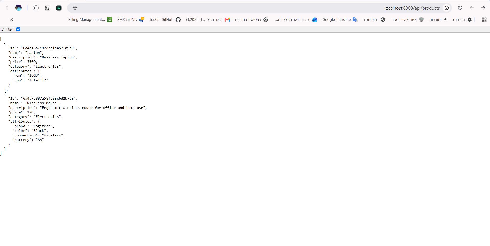
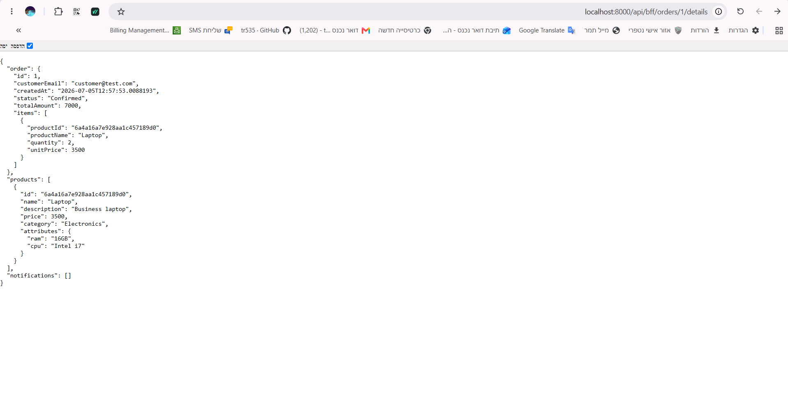
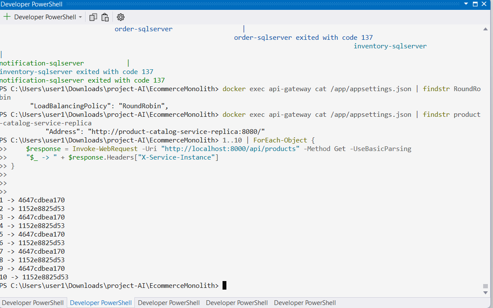

---

## Phase 4 — Async Messaging, Choreography Saga, Idempotency & Redis Cache

### RabbitMQ & Choreography Saga

A `rabbitmq:3-management` container was added (UI at `http://localhost:15672`, guest/guest). The synchronous order flow was replaced by a **choreography-based saga**:

```
OrderService        --publishes--> OrderPlaced
InventoryService    --consumes--> OrderPlaced
                     --checks stock, publishes--> InventoryReserved | InventoryRejected
OrderService         --consumes--> InventoryReserved | InventoryRejected
                     --updates order, publishes--> OrderConfirmed | OrderRejected
NotificationService  --consumes--> OrderConfirmed | OrderRejected
                     --saves notification
```

Contracts are centralized in a shared `MessagingContracts` project (exchange name, routing keys, queue names, message DTOs), so every service references the same message shapes.

**Saga Flow — Happy Path**

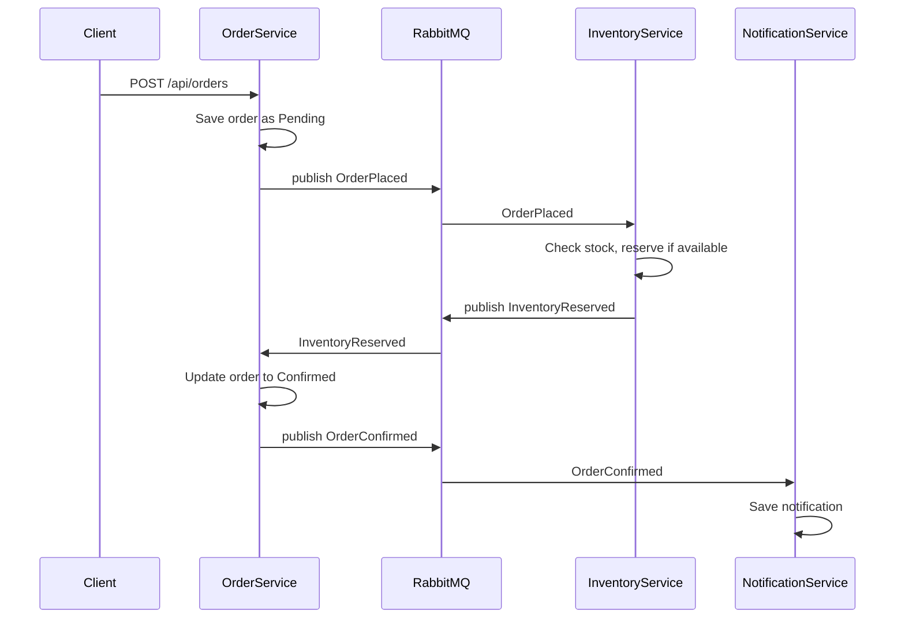

**Saga Flow — Rejected Path**

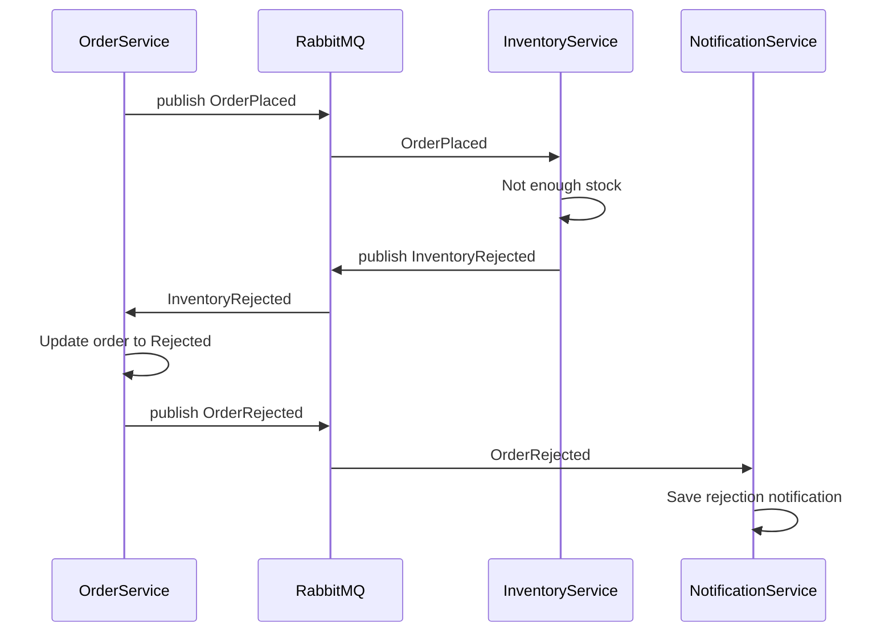

Because RabbitMQ delivers **at-least-once**, `InventoryService` deduplicates using the `InventoryReservations` table (unique index on `OrderId`) before acting on `OrderPlaced` a second time.

### Idempotent Consumers

RabbitMQ guarantees **at-least-once delivery** — the same message can be delivered more than once. To prevent double-reserving stock, `InventoryService` persists every processed order in an `InventoryReservations` table with a **unique index on `OrderId`**. Before reserving stock, the consumer checks whether the order was already handled; if so, it republishes the previous result instead of mutating inventory again.

### Redis Cache (Cache-Aside Pattern)

Redis was added to `ProductCatalogService`, shared by both instances (main + replica):

- `GET /api/products` first checks Redis key `products:all`
  - **Cache hit** → served from Redis
  - **Cache miss** → loaded from MongoDB, then cached for 5 minutes
- `GET /api/products/{id}` cached individually as `products:id:{id}`
- Creating a new product invalidates `products:all`

Because Redis is shared between the two ProductCatalogService replicas, a cache miss on one instance can result in a cache hit on the other — proving the cache is truly shared across load-balanced instances.

**Screenshots**

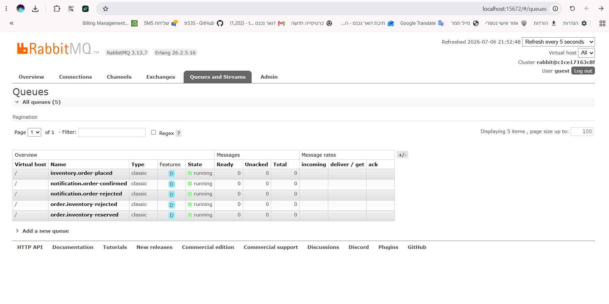
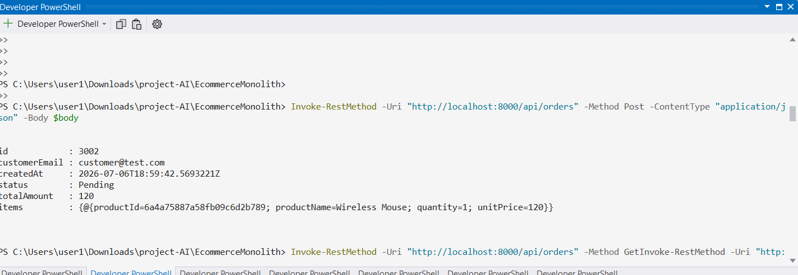
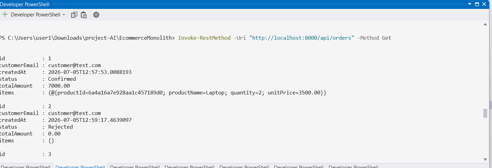
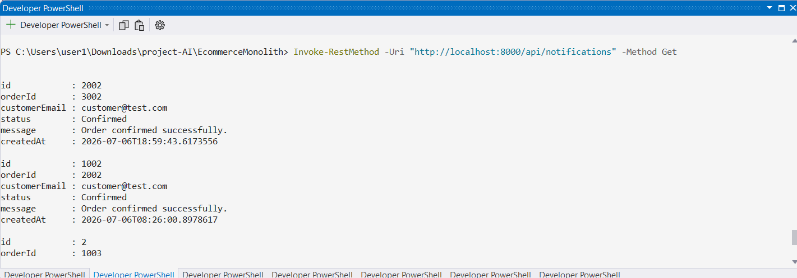
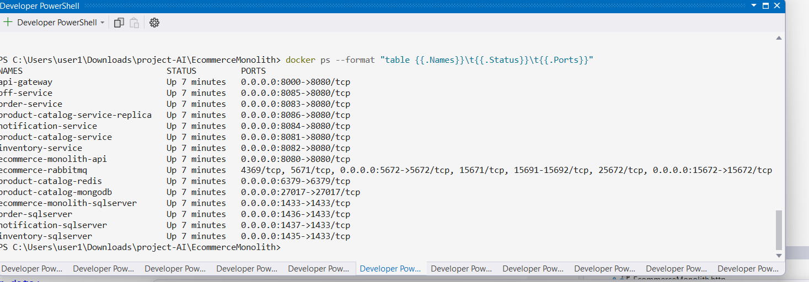
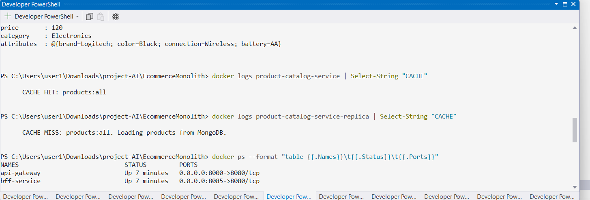

---

## Phase 5 — Health Checks & Observability

### Health Endpoints

Every core service exposes a health endpoint:

```csharp
builder.Services.AddHealthChecks();
// ...
app.MapHealthChecks("/health");
```

Implemented in: ProductCatalogService, InventoryService, OrderService, NotificationService, BffService, ApiGateway.

```
http://localhost:8000/health   -> API Gateway
http://localhost:8081/health   -> ProductCatalogService
http://localhost:8086/health   -> ProductCatalogService (replica)
http://localhost:8082/health   -> InventoryService
http://localhost:8083/health   -> OrderService
http://localhost:8084/health   -> NotificationService
http://localhost:8085/health   -> BffService
```

### Docker Compose Healthchecks

Each core service has a Docker-level healthcheck:

```yaml
healthcheck:
  test: ["CMD-SHELL", "curl -f http://localhost:8080/health || exit 1"]
  interval: 30s
  timeout: 10s
  retries: 3
  start_period: 30s
```

`curl` was added to each service's Dockerfile so the healthcheck command can run inside the container. `docker ps` shows `(healthy)` for all core containers once they pass their first check.

**Screenshots**

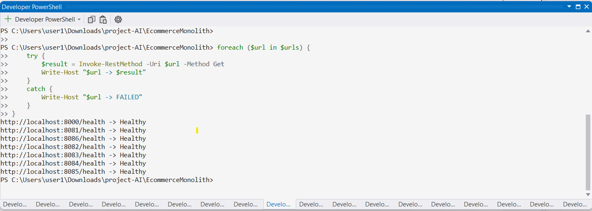
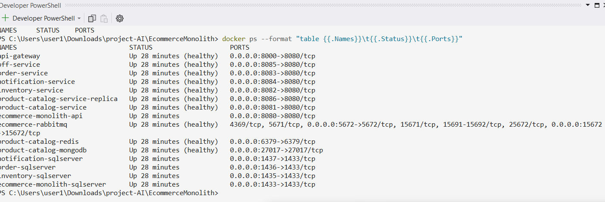

### Planned — Structured Logging & Correlation ID (Not Yet Implemented)

The remaining Phase 5 goals are designed but not yet stably implemented:

- **Structured logging** — Serilog in every service, aggregated to a central [Seq](http://localhost:5341) instance.
- **Correlation ID** — an `X-Correlation-ID` header propagated through the Gateway, HTTP calls, and RabbitMQ messages, so a single order can be traced end-to-end across the saga in Seq.

This work is intentionally left out of the current stable commit to avoid destabilizing a working system under time constraints.

---

## Docker Compose Services

**Application Services**

```
ecommerce-api                    -> http://localhost:8080
product-catalog-service          -> http://localhost:8081
product-catalog-service-replica  -> http://localhost:8086
inventory-service                -> http://localhost:8082
order-service                    -> http://localhost:8083
notification-service             -> http://localhost:8084
bff-service                      -> http://localhost:8085
api-gateway                      -> http://localhost:8000
```

**Databases & Infrastructure**

```
sqlserver                    -> localhost:1433
mongodb                      -> localhost:27017
inventory-sqlserver          -> localhost:1435
order-sqlserver              -> localhost:1436
notification-sqlserver       -> localhost:1437
rabbitmq                     -> localhost:5672 (AMQP), localhost:15672 (management UI)
redis                        -> localhost:6379
```

**Internal Docker URLs** (container-to-container communication)

```
ProductCatalogService          -> http://product-catalog-service:8080
ProductCatalogService Replica  -> http://product-catalog-service-replica:8080
InventoryService               -> http://inventory-service:8080
OrderService                   -> http://order-service:8080
NotificationService             -> http://notification-service:8080
BffService                      -> http://bff-service:8080
```

---

## Project Structure

```
EcommerceMonolith/
│
├── EcommerceMonolith.csproj          # original monolith
├── Dockerfile
├── docker-compose.yml
│
├── src/
│   ├── ProductCatalogService/
│   ├── InventoryService/
│   ├── OrderService/
│   ├── NotificationService/
│   ├── BffService/
│   ├── ApiGateway/
│   └── MessagingContracts/
│
└── docs/
    ├── adr/
    └── screenshots/
        ├── phase-3/
        ├── phase-4/
        └── phase-5/
```

---

## Tech Stack

**Backend**: .NET 8 Web API, C#, Entity Framework Core, MongoDB.Driver, YARP Reverse Proxy, RabbitMQ.Client, StackExchange.Redis, Swagger/OpenAPI

**Databases & Messaging**: SQL Server, MongoDB, RabbitMQ, Redis

**DevOps**: Docker, Docker Compose

---

## Run with Docker

```bash
docker compose up --build
```

Open the API Gateway: `http://localhost:8000`

Swagger UIs:

```
Monolith:              http://localhost:8080/swagger
ProductCatalogService:  http://localhost:8081/swagger
InventoryService:       http://localhost:8082/swagger
OrderService:           http://localhost:8083/swagger
NotificationService:    http://localhost:8084/swagger
BffService:             http://localhost:8085/swagger
```

RabbitMQ management UI: `http://localhost:15672` (guest/guest)

The client should communicate through the API Gateway on port `8000`. Direct service ports remain exposed for development and debugging only.

Stop containers (keep data):

```bash
docker compose down
```

Stop containers and delete all volumes:

```bash
docker compose down -v
```

---

## Verifying the System

**Check container health**

```bash
docker ps --format "table {{.Names}}\t{{.Status}}\t{{.Ports}}"
```

All core services should show `(healthy)`.

**Check health endpoints (PowerShell)**

```powershell
$urls = @(
    "http://localhost:8000/health",
    "http://localhost:8081/health",
    "http://localhost:8086/health",
    "http://localhost:8082/health",
    "http://localhost:8083/health",
    "http://localhost:8084/health",
    "http://localhost:8085/health"
)

foreach ($url in $urls) {
    try {
        $result = Invoke-RestMethod -Uri $url -Method Get
        Write-Host "$url -> $result"
    } catch {
        Write-Host "$url -> FAILED"
    }
}
```

**Test the full saga (create an order)**

```http
POST http://localhost:8000/api/orders
Content-Type: application/json

{
  "customerEmail": "customer@test.com",
  "items": [
    { "productId": "PRODUCT_ID_FROM_MONGODB", "quantity": 1 }
  ]
}
```

Then verify:
- Order status becomes `Confirmed` or `Rejected` (`GET /api/orders/{id}`)
- Inventory was reserved (`GET /api/inventory/{productId}`)
- A notification was created (`GET /api/notifications`)

**Test Redis cache**

```powershell
Invoke-RestMethod -Uri "http://localhost:8000/api/products" -Method Get
docker logs product-catalog-service | Select-String "CACHE"
docker logs product-catalog-service-replica | Select-String "CACHE"
```

Expect one instance to log `CACHE MISS` and the other `CACHE HIT`, proving the cache is shared.

**Test load balancing**

```powershell
1..10 | ForEach-Object {
    $response = Invoke-WebRequest -Uri "http://localhost:8000/api/products" -Method Get -UseBasicParsing
    "$_ -> " + $response.Headers["X-Service-Instance"]
}
```

Expect two different instance values across the 10 requests.

---

## Architecture Decisions Summary

Detailed ADRs are stored under `docs/adr`.

| Service | Database | Reason |
|---|---|---|
| ProductCatalogService | MongoDB | Flexible, category-dependent product attributes |
| InventoryService | SQL Server | Strong consistency required to prevent over-reservation |
| OrderService | SQL Server | Financial/transactional data with relational structure |
| NotificationService | SQL Server | Simple structured records (candidate for future document store if channels multiply) |

## Expected Problems in the Phase 1 Monolith

1. **Tight coupling** — a small change requires rebuilding/redeploying the whole app.
2. **Limited independent scaling** — all features scale together even under uneven load.
3. **Single database bottleneck** — one relational database becomes a performance risk and single point of failure.

## Improvements Introduced

**Phase 2** — service boundaries by business capability, database-per-service, polyglot persistence, independent deployability.

**Phase 3** — single API Gateway entry point, BFF aggregation, load-balanced replicas.

**Phase 4** — async choreography saga (decoupled, resilient to service downtime), idempotent consumers, shared distributed cache.

**Phase 5** — container-level and application-level health visibility for all core services.

---

## Current Status

- Phase 1 — ✅ complete
- Phase 2 — ✅ complete
- Phase 3 — ✅ complete
- Phase 4 — ✅ complete (messaging, saga, idempotency, Redis cache)
- Phase 5 — ✅ health checks + Docker healthchecks complete
- Phase 5 — ⏳ Serilog + Seq + full Correlation ID trace: planned, not yet implemented

## Git Commands Used

```bash
git status
git add .
git commit -m "Add docker compose healthchecks"
git push
```
